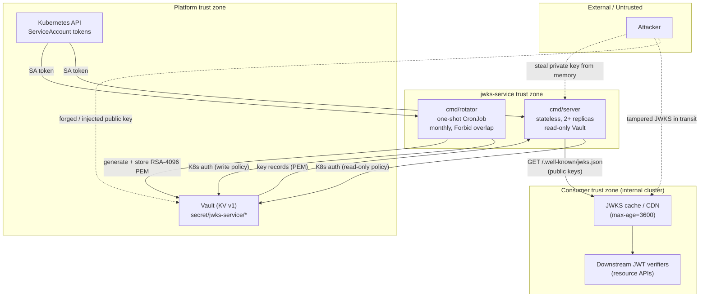

# Threat model — gov-jwks-service

This document describes the security posture of **gov-jwks-service**, the internal
JWKS (JSON Web Key Set) service for a Private Cloud Kubernetes cluster. It manages
RSA-4096 signing keys for internal JWT issuance and publishes the corresponding
public keys at `/.well-known/jwks.json`. It follows a lightweight STRIDE-style
analysis focused on trust boundaries and the controls implemented in this
repository.

Design rationale for the decisions referenced below lives in
[docs/adr/](./adr/). For vulnerability reporting, see [SECURITY.md](../SECURITY.md).

## System context

The service is **two binaries in one repository**, deployed separately:

- `cmd/server` — a stateless HTTP server (2+ replicas) with **read-only** Vault
  access. It syncs keys from Vault on an interval and serves the JWKS, a health
  probe, and Prometheus metrics.
- `cmd/rotator` — a one-shot CronJob with **write** Vault access. It runs monthly,
  generates a new RSA-4096 key pair, stores it in Vault, repoints the active key,
  and prunes expired keys.

The two never share a process. The server holds a read-only Vault policy; only the
rotator can write. Keys live in **Vault KV v1** (flat paths, no `data/` prefix):

```
secret/jwks-service/active           → {"kid": "...", "rotated_at": "..."}
secret/jwks-service/keys/{kid}       → {pem, kid, created_at, expires_at}
```

`kid` is the RFC 7638 JWK thumbprint of the public key, so any RFC 7638-compliant
consumer derives the same identifier for the same key without out-of-band
agreement.

### Architecture diagram

The canonical diagram source lives in [threat-model.mmd](./threat-model.mmd).
Rendered view:



## Assets

| Asset | Sensitivity | Owner |
|-------|-------------|-------|
| Private signing keys (RSA-4096 PEM) | Critical | Vault; loaded into server and rotator memory |
| Vault ServiceAccount identity / K8s SA token | High | Kubernetes / Vault |
| `active` key pointer record | High | Rotator (write); server (read) |
| Published JWKS (public keys) | Medium (integrity, not confidentiality) | Server |

## Trust boundaries

| Boundary | Trusted side | Untrusted side | Service role |
|----------|--------------|----------------|--------------|
| TB-1 | Server | JWKS consumers | Serves read-only **public** keys; never receives client JWTs |
| TB-2 | Vault | Server memory | Server authenticates via K8s auth with a **read-only** policy |
| TB-3 | Vault | Rotator memory | Rotator authenticates via K8s auth with a **write** policy |
| TB-4 | Vault | Kubernetes SA token | `alias_name_source=serviceaccount_name` binds the Vault identity to the SA (ADR-008) |
| TB-5 | Production server | `/internal/sign` | Endpoint is compiled out unless built with `-tags signing` (ADR-009) |

## STRIDE analysis

### Spoofing (authentication)

| Threat | Description | Mitigation in this repo | Residual risk |
|--------|-------------|-------------------------|---------------|
| S-1 | Attacker assumes the service identity to read/write keys in Vault | Kubernetes auth with `alias_name_source=serviceaccount_name` (ADR-008); Vault binds identity to the SA, not a client-supplied name | Compromise of the SA token or Vault itself |
| S-2 | Attacker injects a rogue public key so forged JWTs verify | Only the rotator holds a Vault write policy; the server is strictly read-only (ADR-013) | Compromise of the rotator SA / Vault write path |
| S-3 | Attacker serves a substitute JWKS to consumers | `kid` is the RFC 7638 thumbprint, so a swapped key is detectable by consumers that bind kid→key | Transport integrity is a deployment concern (see Out of scope) |

### Tampering (integrity)

| Threat | Description | Mitigation in this repo | Residual risk |
|--------|-------------|-------------------------|---------------|
| T-1 | Modify key records or the `active` pointer in Vault | Least-privilege Vault policies (`deploy/vault/`); server cannot write | Vault-side compromise; mitigated by Vault audit log (enabled separately) |
| T-2 | Tamper with the JWKS response in transit | Served over cluster TLS/ingress (deployment concern); public keys carry no secrets | Depends on correct ingress/mTLS configuration |
| T-3 | Point `active` at a malformed or empty key record | Records with an empty PEM are rejected; the server returns a hard error and never fabricates keys in memory (ADR-013) | A well-formed but attacker-controlled record still requires Vault write access (see S-2) |

### Repudiation

| Threat | Description | Mitigation in this repo | Residual risk |
|--------|-------------|-------------------------|---------------|
| R-1 | No record of key creation, rotation, or expiry | ECS-structured audit events (`key.created`, `key.loaded`, `key.rotated`, `key.grace_period_started`, `key.expired`) plus Prometheus counters (`jwks_key_rotations_total`, `jwks_keys_expired_total`) | Vault write-level auditing must be enabled separately (not in application scope) |

### Information disclosure

| Threat | Description | Mitigation in this repo | Residual risk |
|--------|-------------|-------------------------|---------------|
| I-1 | Private key PEM exposed at rest | Stored in Vault KV v1; confidentiality depends on the Vault seal and least-privilege policies | Vault seal / storage backend compromise |
| I-2 | **Server holds private key material in memory** although it only publishes public keys | The server decodes the full PEM (`internal/keystore/vault_store.go`); mitigated by read-only Vault, `/internal/sign` compiled out in production (ADR-009), stateless replicas, and no on-disk persistence | Memory disclosure (core dump, container escape). Future hardening: load only the public key in the non-signing server build |
| I-3 | Key material leaks into logs | Structured logging never emits PEM bytes; errors are sentinel-style and key-free | Operator misconfiguration of log verbosity |
| I-4 | JWKS response leaks sensitive data | The JWKS contains only public keys, which are intended to be public | None |

### Denial of service

| Threat | Description | Mitigation in this repo | Residual risk |
|--------|-------------|-------------------------|---------------|
| D-1 | Vault unavailable or no keys present | The server returns a hard error rather than an empty or fabricated JWKS (ADR-013); 2+ replicas and periodic sync tolerate transient Vault outages from the last good state | A prolonged Vault outage combined with a pod restart yields no servable keys |
| D-2 | Overlapping rotations corrupt key state | CronJob `concurrencyPolicy: Forbid` (ADR-011) prevents concurrent rotator runs | Manual out-of-band writes to Vault |
| D-3 | Unbounded key growth in Vault | The rotator prunes expired keys and counts them (`jwks_keys_expired_total`) | Prune failure surfaces via `jwks_key_rotation_errors_total` |
| D-4 | Request flood against the JWKS endpoint | `Cache-Control: public, max-age=3600` enables edge/consumer caching; stateless replicas scale horizontally | Requires cache/ingress in front of the service to be effective |

### Elevation of privilege

| Threat | Description | Mitigation in this repo | Residual risk |
|--------|-------------|-------------------------|---------------|
| E-1 | Server gains write access to Vault | Separate read-only (server) and write (rotator) Vault policies (ADR-013, `deploy/vault/`); enforced by Vault, not the application | Misconfigured Vault policy binding |
| E-2 | `/internal/sign` used to mint arbitrary tokens | The endpoint requires the `signing` build tag and is absent from production images (ADR-009); it still requires non-empty `sub` and `aud` | An image mistakenly built with `-tags signing` reaching production |
| E-3 | Weak or downgraded signing key reduces crypto strength | `KEY_BITS` defaults to 4096 and RS256 is fixed; the rotator generates keys, so no external key material is accepted | Operator lowering `KEY_BITS`. Optional defense-in-depth: reject keys below 2048 bits on load |

## Security controls (this repo)

### Server (`cmd/server`, read-only)

- Read-only Vault policy; cannot create, update, or delete keys (ADR-013).
- Serves only public keys at `/.well-known/jwks.json` with `Cache-Control: public, max-age=3600`.
- Returns a hard error when no valid keys are found — no in-memory fallback.
- `/internal/sign` is compiled out unless built with `-tags signing` (ADR-009).

### Rotator (`cmd/rotator`, write)

- Runs as a CronJob with `concurrencyPolicy: Forbid` (ADR-011).
- Generates RSA-4096 keys (`KEY_BITS`, default 4096) and derives `kid` from the RFC 7638 thumbprint.
- Keeps the previous key valid for a grace period (default 2h, exceeds the 1h JWKS cache; ADR-012).
- Prunes expired keys and emits lifecycle audit events and metrics.

### Platform / Vault

- Kubernetes auth with `alias_name_source=serviceaccount_name` (ADR-008).
- KV v1 flat paths, no `data/` prefix (ADR-007).
- Least-privilege HCL policies split by role in `deploy/vault/`.

## Deployment / operator checklist

Enforced outside this repository — verify when deploying:

- [ ] Vault audit logging enabled (write operations are not logged by the application).
- [ ] TLS/mTLS terminated in front of both the JWKS endpoint and Vault.
- [ ] Server and rotator ServiceAccounts bound to their respective read-only / write Vault policies only.
- [ ] Production server images built **without** `-tags signing`.
- [ ] `KEY_BITS` left at 4096; `GRACE_PERIOD` kept above the longest downstream JWKS cache TTL.
- [ ] NetworkPolicy restricting egress to Vault and the Kubernetes API.
- [ ] Downstream verifiers pin `kid`→key and enforce `exp`, `iss`, and `aud`.

## Out of scope

The following are **deployment / platform** responsibilities, not enforced by this
application:

- Network TLS/mTLS for the JWKS endpoint and Vault connections.
- Vault seal management, storage-backend encryption, and Vault audit log enablement.
- Kubernetes RBAC, NetworkPolicy, and ServiceAccount token lifecycle.
- Rate limiting and CDN/edge caching in front of the JWKS endpoint.
- Downstream JWT verification behavior (`exp`, `iss`, `aud`, algorithm allowlist).
- Identity-provider authentication and JWT issuance policy for consumers.

## References

- RFC 7517 (JWK), RFC 7518 (JWA), RFC 7519 (JWT), RFC 7638 (JWK thumbprint)
- BIO — RSA-4096 supports up to a 4-year key lifetime
- NIS2 Article 21 — demonstrable key management
- [docs/adr/](./adr/) — Architecture Decision Records
- [SECURITY.md](../SECURITY.md) — vulnerability reporting and principles
